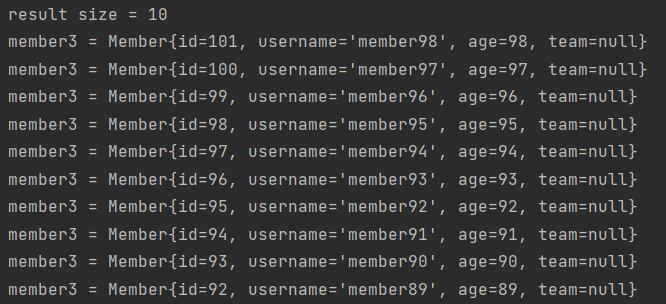

# JPQL
___

#### JPQL 문법
- select m from Member as m where m.age > 18
- 엔티티와 속성은 대소문자 구문O
- JPQL 키워드는 대소문자 구문X
- 엔티티 이름 사용, 테이블 이름 아님
- 별칭은 필수 (as는 생략가능)

#### TypeQuery, Query
- TypeQuery : 반환 타입이 명확할 때 사용
```agsl
TypedQuery<Member> query = em.createQuery("select m from Member m", Member.class);
System.out.println(query.getResultList().size());
=> 반환값을 받으려면 반환 타입을 명시해줘야한다.
```
- Query : 반환 타입이 명확하지 않을 때 사용

#### 결과 조회
- query.getResultList()
  - 결과가 하나 이상일 때 리스트 반환
  - 결과가 없으면 빈 리스트 반환(널 포인트 이셉션 신경 안 써도 된다.)
- query.getSingleResult()
  - 결과가 정확히 하나, 단일 객체 반환
  - 결과 값이 비어있거나 두 개 이상이면 예외 발생

#### 파라미터 바인딩 - 이름 기준, 위치 기준
- 이름 기준
```agsl
//        TypedQuery<Member> query1 = em.createQuery("select m from Member m where m.username = :username", Member.class);
//        query1.setParameter("username", "member1");
//        Member singleResult = query1.getSingleResult();
//        System.out.println(singleResult.getUsername());

Member result = em.createQuery("select m from Member m where m.username = :username", Member.class)
        .setParameter("username", "member1")
        .getSingleResult();
System.out.println(result.getUsername());
```
- 위치 기준
```agsl
SELECT m FROM Member m where m.username=?1
query.setParameter(1, uwernameParam);
```
  - 중간에 뭐 하나 추가하면 다 밀릴 수 있기 때문에 안 쓰는 것이 좋다.

#### 프로젝션
- SELECT 절에 조회할 대상을 지정하는 것
- 프로젝션 대상: 엔티티, 임베디드 타입, 스칼라 타입(숫자, 문자 등 기본 데이터 타입)
- DISTINCT로 중복 제거
- JOIN을 명시해주지 않아도 JOIN이 되는 경우. 명시적으로 JOIN을 써주는 것이 좋다.

#### 프로젝션 - 여러 값 조회
ex) SELECT m.username, m.age FROM Member m;
- Query 타입으로 조회
```agsl
List resultList = em.createQuery("select m.username, m.age from Member m").getResultList();

Object o = resultList.get(0);
Object[] result1 = (Object[]) o;
System.out.println(result1[0]);
System.out.println(result1[1]);
```
- Object[] 타입으로 조회
```agsl
List<Object[]> resultList1 = em.createQuery("select m.username, m.age from Member m")
        .getResultList();

System.out.println(result1[0]);
System.out.println(result1[1]);
```
- new 명령어로 조회 **제일 깔끔
  - 단순 값을 DTO로 바로 조회
  - 패키지 명을 포함한 전체 클래스 명 입력
  - 순서와 타입이 일치하는 생성자 필요
```agsl
  List<MemberDTO>  resultDTO = em.createQuery("select new jpql.MemberDTO(m.username, m.age) from Member m", MemberDTO.class)
                .getResultList();

  MemberDTO memberDTO = resultDTO.get(0);
  System.out.println(memberDTO.getUsername());
  System.out.println(memberDTO.getAge());
```
```agsl
public class MemberDTO {
private String username;
private int age;

public MemberDTO(String username, int age) {
    this.username = username;
    this.age = age;
}
getter,setter
}
```

#### 페이징 API
- JPA는 페이징을 다음 두 API로 추상화
- setFirstResult(int startPosition) : 조회 시작 위치 (0부터 시작)
- setMaxResults(int maxResult) : 조회할 데이터 수
```agsl
//페이징
for(int i = 0; i < 100; i++){
Member member2 = new Member();
member2.setUsername("member"+i);
member2.setAge(i);
em.persist(member2);
}
em.flush();
em.clear();

List<Member> result2 = em.createQuery("select m from Member m order by m.age desc", Member.class)
                .setFirstResult(1)
                .setMaxResults(10)
                .getResultList();

System.out.println("result size = " + result2.size());
for(Member member3 : result2){
    System.out.println("member3 = " + member3);
}
```


#### 조인
- 내부 조인
  ```
  SELECT m FROM Member m [INNER] JOIN m.team t;
  ```
- 외부 조인
  ```agsl
  SELECT m FROM Member m LEFT [OUTER] JOIN m.team.t;
  ```
- 세타 조인(연관관계 없는 말도 안되는 커리를 날리는 경우)
  ```agsl
  select count(m) from Member m, Team t where m.username = t.name;
  ```