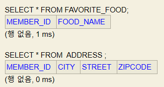
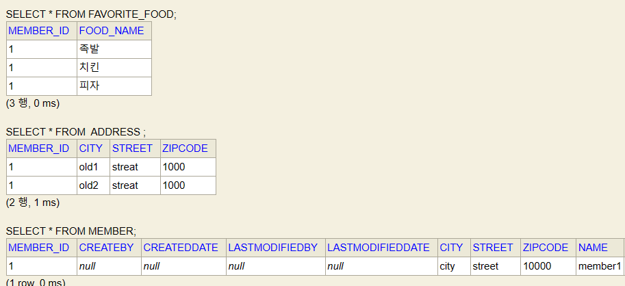

# 기본값 타입
___
(임베디드 타입, 값 타입 컬렉션 두가지가 중요)

## 기본값 타입
- 엔티티 타입
  - @Entity로 정의하는 객체
  - 데이터가 변해도 식별자로 지속해서 추적가능
- 값 타입
  - int, Integer, String 처럼 단순히 값으로 사용하는 타입이나 객체
  - 식별자가 없음, 변경시 추적 불가

## 값 타입 분류
- 기본값 타입
  - 자바 기본 타입(int, double)
  - 래퍼 클래스(Integer, Long)
  - String
- 임베디드 타입(embedded type, 복합 값 타입)
- 컬렉션 값 타입(collection value type)

### 기본 값 타입
- 생명주기를 엔티티의 의존 ** 중요
- 값 타입은 공유하면 x
  - 자바의 기본 타입은 절대 공유 x (사이드 이펙트 x)
```agsl
int a = 10;
int b = a; // 복사가 되어 값이 넣어지는 것이다. 공유가 되지 않는다.
a = 20

System.out.println(a); //20
System.out.println(b); //10
```
  - Integer같은 래퍼 클래스나 String 같은 특수한 클래스는 공유 가능한 객체이지만 변경 x
```agsl
Integer a = new Integer(10);
Intger b = a; //참조값이 넘어감
//같은 값을 참조하고 있기 때문에 값을 변경하면 둘다 바뀌지만, 값을 바꿀 수 있는 방법이 없음
//사이드 이펙트 원천 차단
System.out.println(a); //20
System.out.println(b); //10
```

### 임베디드 타입
- 새로운 값 타입을 직접 정의할 수 있음
- JPA 임베디드 타입이라고 함
- 주로 기본 값 타입을 모아서 만들어서 복합 값 타입이라고도 함
- int, String과 같은 값 타입
- 기본 생성자 필수

#### 임베디드 타입 사용법
- @Embeddable: 값 타입을 정의하는 곳에 표시
- @Embedded: 값 타입을 사용하는 곳에 표시
- 기본생성자 만들기
```agsl
@Embeddable
public class Period {

  LocalDateTime startDate;
  LocalDateTime endDate;

    public boolean isWork() {
        여러가지 로직을 짤 수 있음
        return true;
    }
}

@Embeddable
public class Address {

    private String city;
    private String street;
    @Column(name = "ZIPCODE")
    private String zipcode;
}

@Entity
public class Member extends BaseEntity {
    @Id @GeneratedValue
    @Column(name="MEMBER_ID")
    private Long id;
    private String name;

    @Embedded
    private Period workPeriod;

    @Embedded
    private Address homeAddress;
 }
```

#### 임베디드 타입의 장점
- 재사용
- 높은 응집도
- Period.isWork()처럼 해당 값 타입만 사용하는 의미있는 메소드를 만들 수 있음
- 임베디드 타입을 포함한 모든 값 타입은 값 타입을 소유한 엔티티에 생명주기를 의존함


#### 임베디드 타입과 테이블 매핑
- 임베디드 타입을 사용하기 전과 후에 매핑하는 테이블을 같다.
- DB는 상관없음. 매핑만 좀 다르게 해주면 된다.
- 이렇게 묶어주는 이유는 자바에서 객체는 메소드(행위)를 가지고 있기 때문에 효율적으로 값을 사용할 수 있기 때문.
- 임베디드 타입은 엔티티의 값일 뿐이다.
- 객체와 테이블을 아주 세밀하게(find-grained) 매핑하는 것이 가능. 메서드로 만들어서 세밀하게 만들기 좋음.
- 잘 설계한 ORM 애플리케이션은 매핑한 테이블의 수보다 클래스의 수가 더 많다.
- 임베디드 타입에 객체도 저장 가능

#### @AttributeOverride: 속성 재정의
- 한 엔티티에서 같은 값 타입을 사용하려면?
- 컬럼 명이 중복됨
- @AttributeOverrides, @AttributeOverride를 사용해서 컬럼 명 속성을 재정의
- 
```agsl
@Entity
public class Member extends BaseEntity {
    @Id @GeneratedValue
    @Column(name="MEMBER_ID")
    private Long id;
    private String name;

    @Embedded
    private Period workPeriod;
    
    @Embedded
    private Address homeAddress;

    @Embedded
    @AttributeOverrides({@AttributeOverride(name = "city",
            column = @Column(name = "WORK_CITY")),
            @AttributeOverride(name = "street",
            column = @Column(name = "WORK_STREET")),
            @AttributeOverride(name = "zipcode",
            column = @Column(name = "WORK_ZIPCODE"))
    })
    private Address workAddress;
}
```

#### 입베디드 타입과 null
- 입베디드 타입의 값이 null이면 매핑한 컬럼 값은 모두 null

### 값 타입과 불변 객체
- 임베디드 타입 같은 값 타입을 여러 엔티티에서 공유하면 위험함. 복사해서 사용하도록 하자.
- 주장용(side effect) 발생
```agsl
Address address = new Address("city", "street", "10000");
Member member1 = new Member();
member1.setName("member1");
member1.setHomeAddress(address);
em.persist(member1);

Member member2 = new Member();
member2.setName("member1");
member2.setHomeAddress(address);
em.persist(member2);

//하나만 바꿨는데 update 쿼리가 두 개 나가게 되고 두객체 모두 값이 newCity로 바뀌게 된다.
member1.getHomeAddress().setCity("newCity");
//해결방법 값을 복사해서 사용해야 한다.
Address copyAddress = new Address(address.getCity(), address.getStreet(), address.getZipcode());
```
- 만약 공유되는 것을 의도했다고 말한다면, 값 타입을 쓰면 안되고 entity를 썼어야 했다.

#### 객체 타입의 한계
- 항상 값을 복사해서 사용하면 공유 참조로 인해 발생하는 부작용을 피할 수 있다.
- 문제는 임베디드 타입처럼 직접 정의한 값 타입은 자바의 기본 타입이 아니라 객체 타입이다.
- 자바 기본 타입에 값을 대입하면 값을 복사한다.
- 객체 타입은 참조 값을 직접 대입하는 것을 막을 방법이 없다.
- 객체의 공유 참조는 피할 수 없다.
```agsl
// 기본 타입
int a = 10;
int b = a;
b = 4;

// 객체 타입
Address a = new Address("OLD");
Address b = a; // 객체 타입은 참조를 전달
b.setCity("New");
```

### 불변객체
- 객체 타입을 수정할 수 없게 만들면 부작용을 원천 차단
- 값 타입은 불변 객체(immutable object)로 설계해야 함
- 불변 객체: 생성 시점 이후 절대 값을 변경할 수 없는 객체
- 가장 간단한 방법 : 생성자로만 값을 설정하고 수정자(Setter)를 만들지 않으면 됨. 아니면 private으로 만들면 됨.
- 참고: Integer, String은 자바가 제공하는 대표적인 불변 객체

* 만약 값을 바꾸고 싶으면?
- 새로 객체 만들어서 넣어주면 됨

### 간단히 말하면 값타입은 웬만하면 모두 불변으로 만들어라

### 값 타입의 비교
- 동일성(identity) 비교 : 인스턴스의 참조 값을 비교, == 사용
- 동등성(equivalence) 비교 : 인스턴스의 값을 비교, equals() 사용
- 값 타입은 a.equals(b)를 사용해서 동등성 비교를 해야 함
- 값 타입의 equals() 메소드를 적절하게 재정의(주로 모든 필드 사용). equals의 기본 비교가 == 이기 때문에 재정의해야 함.
- equals 오버라이드는 웬만하면 자동으로 만들어주는 것을 사용하자
- equlas 오버라이드할 때 use getter during code generation을 체크해주는 것이 좋다.
- > proxy를 사용할 때 필드에 직접 접근하지 않고 get으로 접근해야 하기 때문에
```agsl
 @Override
    public boolean equals(Object o) {
        if (this == o) return true;
        if (o == null || getClass() != o.getClass()) return false;
        Address address = (Address) o;
        return Objects.equals(city, address.city) && Objects.equals(street, address.street) && Objects.equals(zipcode, address.zipcode);
    }

    @Override
    public int hashCode() {
        return Objects.hash(city, street, zipcode);
    }
```

### 값 타입 컬렉션
- 값 타입을 하나 이상 저장할 때 사용
- @ElementCollection, @CollectionTable 사용
- 데이터베이스 컬렉션을 같은 테이블에 저장할 수 없다.
- 컬렉션을 저장하기 위해서는 별도의 테이블이 필요함

```agsl
@Entity
public class Member extends BaseEntity {
    @Id @GeneratedValue
    @Column(name="MEMBER_ID")
    private Long id;

    @ElementCollection
    @CollectionTable(name = "FAVORITE_FOOD", joinColumns =
    @JoinColumn(name="MEMBER_ID"))
    @Column(name = "FOOD_NAME")
    private Set<String> favoriteFoods = new HashSet<>();

    @ElementCollection
    @CollectionTable(name = "ADDRESS", joinColumns =
    @JoinColumn(name = "MEMBER_ID"))
    private List<Address> addressHistory = new ArrayList<>();
}
```


#### 값타입 입력
```agsl
Address address = new Address("city", "street", "10000");
Member member1 = new Member();
member1.setName("member1");
member1.setHomeAddress(address);

member1.getFavoriteFoods().add("치킨");
member1.getFavoriteFoods().add("피자");
member1.getFavoriteFoods().add("족발");

member1.getAddressHistory().add(new Address("old1", "streat", "1000"));
member1.getAddressHistory().add(new Address("old2", "streat", "1000"));
em.persist(member1);
```


- 맴버만 persist도 값타입들은 자동으로 들어감.
- 값 타입들의 생명주기는 entity에 의존
- 값 타입 컬렉션은 영속성 전이(cascade) + 고아 객체 제거 기능을 필수로 가진다고 할 수 있다.
- 조회할 때 임베디드 타입은 같이 조회가 되지만 컬렉션은 같이 조회되지 않는다(기본값이 지연 로딩이라는 뜻)

#### 값타입 컬렉션 조회
```agsl
 Member findMember = em.find(Member.class, member1.getId());

List<Address> addressHistory = findMember.getAddressHistory();

for(Address a : addressHistory){
    System.out.println(a.getCity());
}
```

### 값타입 컬렉션 수정
- 불변객체이기 때문에 삭제하고 새로 넣어줘야 한다.
```agsl
//수정 이렇게 할 수 없음. 불변 객체이기 때문이다.
//이렇게 해버리면 값타입은 사이드 이펙트가 생길 수 있음.
findMember.getHomeAddress().setCity("newCity");
//수정하려면 완전히 새로 넣어야 한다.
Address a = findMember.getHomeAddress();
findMember.setHomeAddress(new Address("newCity", a.getStreet(), a.getZipcode() ));

//치킨 => 한식
findMember.getFavoriteFoods().remove("치킨");
findMember.getFavoriteFoods().add("한식");
```

#### 값 타입 컬렉션의 제약사항
- 값 타입은 엔티티와 다르게 식별자 개념이 없다.
- 값은 변경하면 추적이 어렵다.
- 값 타입 컬렉션에 변경사항이 발생하면, 주인 엔티티와 연관된 모든 데이터를 삭제하고, 값 타입 켤렉션에 있는 현재 값을 모두 다시 저장한다.
  (뭔가 쓰면 안될 것 같은 느낌ㅇㅣ...)
- 값 타입 컬렉션을 매핑하는 테이블은 모든 칼럼을 묶어서 기본키를 구성해야 함: null 입력x, 중복저장x

#### 값 타입 컬렉션 대안
- 실무에서는 상황에 따라 값 타입 컬렉션 대신에 일대다 관계를 고려
- 일대다 관계를 위한 엔티티를 만들고, 여기에서 값 타입을 사용
- 영속성 전이(cascade) + 고아 객체 제거를 사용해서 값 타입 컬렉션처럼 사용

```agsl
@Entity
@Table(name = "ADDRESS")
public class AddressEntity {
  @Id @GeneratedValue
  private Long id;
  
  private Address address;
}
```
```agsl
@OneToMany(cascade = CascadeType.ALL, orphanRemoval = true)
@JoinColumn(name = "MEMBER_ID")
private List<AddressEntity> addressHistory = new ArrayList<>();
```

#### 그럼 값타입 컬렉션 언제 사용?
- 정말 단순할 때.
- 체크박스 값 넣는 것과 같이 추적

#### 값 타입 정리
- 엔티티 타입의 특징
  - 식별자 o
  - 생명 주기 관리
  - 공유
- 값 타입의 특징
  - 식별자 x
  - 생명 주기를 엔티티에 의존
  - 공유하지 않는 것이 안전(복사해서 사용)
  - 불변 객체로 만드는 것이 안전