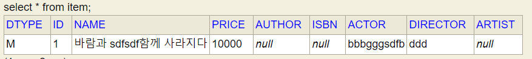
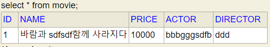

# 상속관계 매핑
___

- 관계형 데이터베이스는 상속 관계 x
- 슈퍼타입 서브타입 관계라는 모델링 기법이 객체 상속과 유사
- 상속관계 매핑: 객체의 상속 구조와 DB의 슈퍼타입 서브타입 관계를 매핑

1. 각각 테이블로 변환 -> 조인전략
2. 단일 테이블 전략(논리 모델을 그냥 모두 하나로 합쳐버림, DTYPE으로 무슨 제품인지 구별)
3. 구현 클래스마다 테이블 전략 => 서브 테이블로 변환
* 어떤 방법으로 하든 다 가능함.

Book, Album, Movie extends Item을 하고 바로 실행해보면 단일 테이블 전략으로 테이블이 만들어진다.
jpa 기본 설정이 단일 테이블 전략으로 되어있다는 것을 알 수 있다.
```agsl
@Entity
public class Item {

    @Id
    @GeneratedValue
    private Long id;

    private String name;
    private int price;
}

@Entity
public class Album extends Item {
    private String artist;
}

@Entity
public class Book extends Item {
    private String author;
    private String isbn;
}

@Entity
public class Movie extends Item {
    private String director;
    private String actor;
}

 =>create table Item (
       DTYPE varchar(31) not null,
        id bigint not null,
        name varchar(255),
        price integer not null,
        author varchar(255),
        isbn varchar(255),
        actor varchar(255),
        director varchar(255),
        artist varchar(255),
        primary key (id)
    )
```

### 주요 어노테이션
@Inheritance(strategy = InheritanceType.JOINED)
1. JOINED : 조인전략 (em.persist할 때도 각 테이블에 값을 넣어주고 조회할 때에도 이너 조인해서 가져옴)
    - 장점
      - 정규화 되어 있음.
      - 외래 키 참조 무결성 제약조건 활용 가능
      - 저장공간 효율화
    - 단점
      - 조회시 조인을 많이 사용. 성능 저하
      - 조회 쿼리가 복잡함
      - 데이터 저상시 insert sql 2번 호출
      - 하지만 성능에 정말 많은 영향을 미치진 않는다. 웬만하면 조인전략이 정석이라고 생각하고 수행하길 바란다.
            
2. SINGLE TABLE : 단일 테이블 전략

   - 장점
       - 조인이 필요 없으므로 일반적으로 조회 성능이 빠름
       - 조회 쿼리가 단순함
   - 단점
       - 자식 엔티티가 매핑한 컬럼은 모두 null 허용.
       - 단일 테이블에 모든 것을 저장하므로 테이블이 커질 수 있어 상황에 따라서 조회 성능이 오히려 느려질 수 있다.
3. TABLE_PER_CLASS : 구현 클래스마다 테이블 전략

   - Item을 추상클래스로 만들어야 함. 안그러면 item 테이블이 생성된다.
   - @DiscriminatorColumn 만들어도 안 생긴다. 쓸모없으니까!
   - Item 타입(부모클래스)으로 조회하면 movie, album, book을 union으로 다 뒤져서 찾는다. 그래서 성능상 문제가 될 수 있음.
   - 이 전략은 데이터베이스 설계자와 ORM 전문가 둘 다 추전하지 않음
   - 장점
     - 서브 타입을 명확하게 구분해서 처리할 때 효과적
     - not null 제약조건 사용가능
   - 단점
     - 여러 자식 테이블을 함께 조회할 때 성능이 느림(union sql)
     - 자식 테이블을 통합해서 쿼리하기 어려움

@DiscriminatorColumn
- DTYPE 컬럼을 만들어준다.
- 싱글테이블 전략에서는 무조건 들어가야 함.

@DiscriminatorValue("A")
- A라는 이름으로 자식 테이블을 만들겠다.

# @MappedSuperClass
___
- 테이블과 관계 없고, 단순히 엔티티가 공통으로 사용하는 매핑 정보를 모이는 역할
- 주로 등록일, 수정일, 등록자, 수정자 같은 전체 엔티티에서 공통으로 적용하는 정보를 모을 때 사용
- 참고 : @Entity 클래스는 엔티티나 @MappedSuperclass로 지정한 클래스만 상속 가능

- 공통 정보를 담은 Entity를 만든 후 @MappedSuperClass 어노테이션을 붙인다.
- 그리고 공통 정보가 필요한 class에 extends로 상속 시켜준다.
- 상속관계 매핑이 아니다 그냥 공통적으로 사용되는 column을 관리해주는 아이
- 엔티티도 아니고 테이블과 매핑되지도 않는다.
- 부모 클래스를 상속 받는 자식 클래스에 매핑 정보만 제공
- 조회, 검색 불가
- 직접 생성해서 사용할 일이 없으므로 추상 클래스 권장