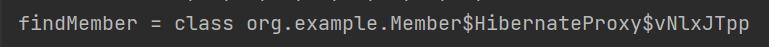

# 프록시
___

### 멤버 정보를 DB에서 조회할 때. team 정보가 필요할 때도 있고 없을 때도 있다.

### 1. 프록시 기초
- em.find() vs em.getReference()
- em.find() : 데이터베이스를 통해서 실제 엔티티 객체를 조회
- em.getReference() : 데이터베이스 조회를 미루는 가짜(프록시) 엔티티 객체 조회(DB 쿼리가 안 날아가는데 조회가 된다.)
진짜 데이터가 사용되는 시점에 쿼리가 날아간다.

```agsl
 Member findMember = em.getReference(Member.class, member.getId());
 System.out.println("findMember = " + findMember.getClass());
```
- 가짜 객체라는 것을 보여줌. => 프록시 클래스

- Proxy 객체의 Entity target에 실제 객체의 참조(target)를 보관
- 프록시 객체를 호출하면 프록시 객체는 실제 객체의 메소드 호출

### 2. 프록시의 특징
- 실제 클래스를 상속받아서 만들어짐
- 실제 클래스와 겉 모양이 같다.
- 사용하는 입장에서는 진자 객체인지 프록시 객체인지 구분하지 않고 사용하면 된다.(이론상)

### 3. 프록시 객체의 초기화
- 처음에는 타겟 값이 비어있음 -> 값을 요청했을 때 영속성 컨텍스트에게 값을 가져오라고 시킨다.(초기화 요청)
- 그럼 영속성 컨텍스트는 DB에서 조회하여 실제 Entity를 생성한다.

### 4. 프록시의 특징 2
- 프록시 객체는 처음 사용할 때 한 번만 초기화
- 프록시 객체를 초기화 할 때. 프록시 객체가 실제 엔티티로 바뀌는 것은 아님. **중요
- 초기화가 되면 프록시 객체를 통해서 실제 엔티티에 접근 가능
- 프록시 객체는 원본 엔티티를 상속받음. 따라서 타입 체크시 주의해야 함 (== 비교 실패, 대신 instance of 사용) ** 중요
- 영속성 컨텍스트에 찾는 엔티티가 이미 있으면 em.getReference()를 호출해도 실제 엔티티 반환 ** 중요
-> 이미 캐시에 있는데 프록시로 만들어봤자 아무 소용이 없기 때문.
-> 객체의 동일성을 보장해줘야 하기 때문에
  - 이미 캐시에 있는 애랑 reference랑 조회한 아이랑 같음을 보장해줘야 하기 때문에
  - reference == reference도 똑같은 Entity 주소를 갖는다. 
  - Proxy 먼저 조회하고 find하면 둘이 동일함을 보장해줘야 하기 때문에 find 객체도 proxy로 조회된다.
- 영속성 컨텍스트의 도움을 받을 수 없는 준영속 상태일 때, 프록시를 초기화하면 문제 발생
  - 하이버네이트는 org.hibernate.LazyInitializationException 예외를 터트림
  - detach했을 때, em.close() 했을 때. 조회할 수 없음.

### 5. 프록시 확인
```agsl
//프록시 인스턴스의 초기화 여부 확인
PersistenceUnitUtil.isLoaded(Object entity)

//프록시 클래스 확인 방법
// ..javasist.. 또는 HibernateProxy가 출력된다.
entity.getClass().getName()
entity.getClass()

// 프록시 강제 초기화
// JPA 표준은 강제 초기화 없음. 강제호출 : member.getName() -> 근데 이건 없어보여
Hibernate.initialize(entity);
```

# 즉시로등과 지연로딩
___

### - 지연 로딩 LAZY를 사용해서 프록시로 조회
- member와 team을 같이 조회하는 경우가 적을 때.
```agsl
// 조회하면 team은 프록시로 조회된다.
@ManyToOne(fetch = FetchType.LAZY)
@JoinColumn(name = "TEAM_ID")
private Team team;

Member m = em.find(Member.class, member1.getId());
// 프록시가 조회된다.
System.out.println("m = " + m.getTeam().getClass());
//이때 쿼리가 나간다.
// 실제 team을 사용하는 시점에 초기화된다.
m.getTeam().getTeam();
```
### - 즉시 로딩 EAGER를 사용해서 함께 조회
```agsl
@ManyToOne(fetch = FetchType.EAGER)
@JoinColumn(name = "TEAM_ID")
private Team team;
```
- 조회할 때 조인해서 한방에 다 가지고 온다. Proxy가 아니라 실제 객체가 조회된다.
- JPA 구현체는 가능하면 조인을 사용해서 SQL 한번에 함께 조회한다.

### 프록시와 즉시로딩 주의
- 가급적 지연 로딩만 사용(특히 실무에서)
- 즉시 로딩을 적용하면 예상하지 못한 SQL이 발생(조인이 다섯개 이상만 되면 성능이..., 실무에서는 테이블이 복잡하게 연결되어 있으므로 주의)
- 즉시 로딩은 JPQL에서 N+1 문제를 일으킨다.
```agsl
//pk로 하나만 가져오는 것은 상관없음
Member m = em.find(Member.class, member1.getId());

List<Member> members = em.createQuery("select m from Member m", Member.class).getResultList();
// Member를 가져와야지 하면서 SELECT * FROM MEMBER 쿼리를 보낸다
// 어라? EAGER네? 하면서 SELECT * FROM TEAM WHERE TEAM_ID = XXX를 또 보내게 된다.
```

```agsl
Team team1 = new Team();
team1.setName("aaa");
em.persist(team1);

Team team2 = new Team();
team2.setName("aaa");
em.persist(team2);

Member member1 = new Member();
member1.setName("asdf");
member1.setTeam(team1);
em.persist(member1);

Member member2 = new Member();
member2.setName("asdf");
member2.setTeam(team2);
em.persist(member2);

em.flush();
em.clear();

//이 경우 Member를 다 가져오는 쿼리를 보냄 (1)
//그 다음 Member 2명이 가지고 있는 팀이 다르니 쿼리 2개를 더 보내게 됨 (N)
List<Member> members = em.createQuery("select m from Member m", Member.class)
        .getResultList();
```
  -> 해결방법 : 일단 모두 lazy로 깔고 fetch조인으로 동적으로 선택해서 가져온다.(나중에 배울 것)
- @ManyToOne, @OneToOne 기본이 즉시 로딩 -> lazy로 설정 ** 중요
- @OneToMany, @ManyToMany는 기본이 지연로딩

### 지연 로딩 활용 - 실무
- 모든 연관관계에 지연 로딩을 사용해라
- JPQL fetch 조인이나, 엔티티 그래프 기능을 사용해라
- 즉시 로딩은 상상하지 못한 쿼리가 나간다.